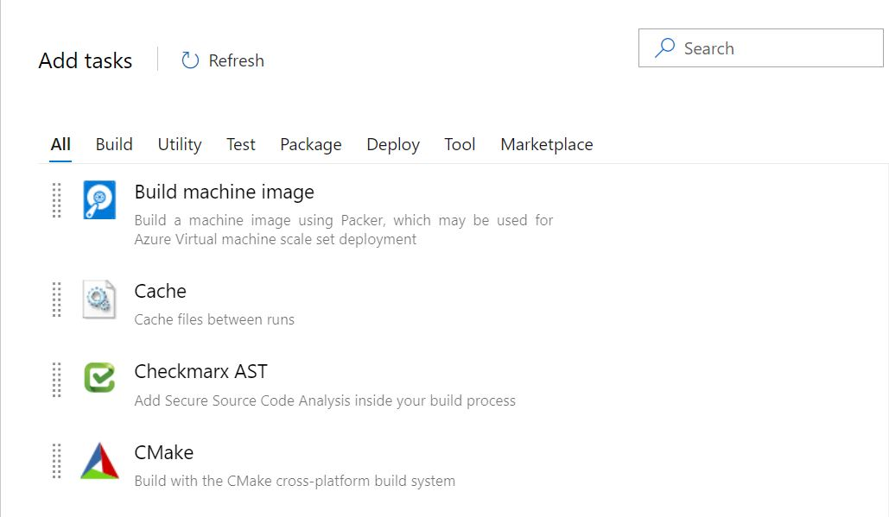
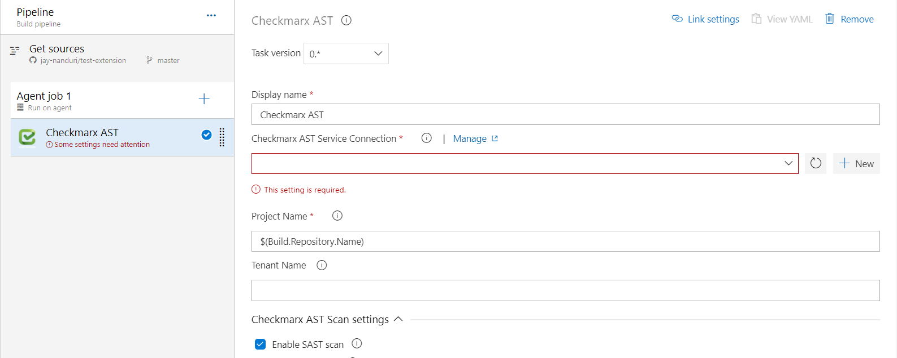
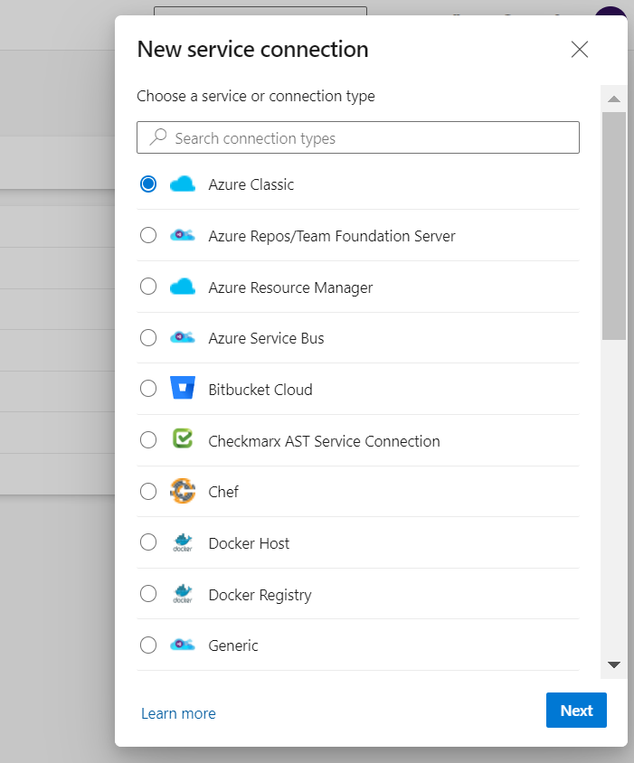
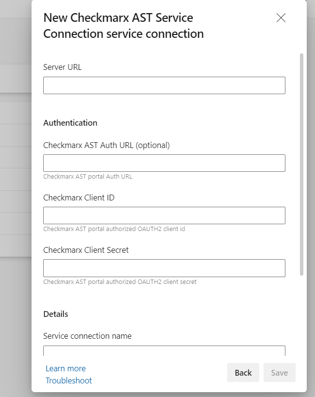

###### Overview

###### Checkmarx is a powerful single unified security solution for Static Source Code Analysis (SAST), dependency scanning(SCA), KICS and container scanning analysis designed for identifying, tracking and fixing technical and logical security flaws.

Checkmarx is integrated seamlessly into the Microsoft’s Software Development Life Cycle (SDLC), enabling
the early detection and mitigation of crucial security flaws.

###### Getting Started with Checkmarx:

**To complete this step:**
1.	From the Build menu in the main screen, add Checkmarx build step
2.	Click Add to configure Checkmarx and configure the properties

###### Configure Checkmarx Build Step

**To complete this step:**

1.	Project Name: Enter a new project name or default to $(Build.Repository.Name). The default name will contain the SCM repository name.
2.	Tenant Name: Please provide your AST Tenant name
3.	Additional Parameters: Please provide any additional parameters for the scan to complete (--sast-preset-type "Checkmarx Default")
4.  Zip File Filters: Source code directories/Files that get zipped and sent to AST server for scanning

###### Configure Checkmarx AST Service Connection Step

**To complete this step:**

Please select the Checkmarx AST service Connection option to create a new service connection to AST portal
1.	Server URL: Enter the AST endpoint URL
2.	Checkmarx AST Auth URL: Enter the optional Auth URL
3.	Checkmarx Client ID: Please enter the AST OAuth Client ID
4.  Checkmarx Client Secret: Please enter the AST OAuth Client Secret
  